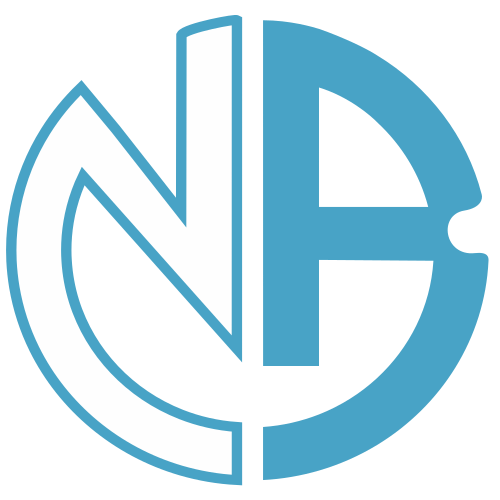

<a name="readme-top"></a>

  <!-- PROJECT SHIELDS -->

<!-- [![Forks][forks-shield]][forks-url]
[![Stargazers][stars-shield]][stars-url] -->
[![Contributors][contributors-shield]][contributors-url]
[![Issues][issues-shield]][issues-url]
[![MIT License][license-shield]][license-url]
[![LinkedIn][linkedin-shield]][linkedin-url]

  <!-- PROJECT LOGO -->

  <br />
  <div align="center">
    <a href="https://github.com/nrhartfrc/personalwebsite">
      
    </a>
    <h1 align="center">Nicholas Rombach</h1>
    <p align="center">
    <br/>
    Explore my journey, projects, and passions in this immersive portfolio powered by ReactJS.<br/>
      <br/>
      Author: Nicholas Rombach<br>
      Originator: M. Yeates
      <br/>
      <br/>
      <a href="https://github.com/nrhartfrc/personalwebsite"><strong>Explore the docs »</strong></a>
      <br/>
      <br/>
      <a href="https://nrhartfrc.github.io/personalwebsite">View Live Website</a>
      ·
      <a href="https://github.com/nrhartfrc/personalwebsite/issues">Report Bug</a>
      ·
      <a href="https://github.com/nrhartfrc/personalwebsite/issues">Request Feature</a>
    </p>
  </div>
  
  <!-- TABLE OF CONTENTS -->

  <details>
    <summary><b>Table of Contents</b></summary>
    <ol>
      <li>
        <a href="#about-the-project">About The Project</a>
        <ul>
          <li><a href="#photos">Photos</a></li>
          <li><a href="#built-with">Built With</a></li>
          <li><a href="#description">Description</a></li>
        </ul>
      </li>
      <li>
          <a href="#getting-started">Getting Started</a>
        <ul>
          <li><a href="#prerequisites">Prerequisites</a></li>
          <li><a href="#installation">Installation</a></li>
        </ul>
      </li>
      <li><a href="#license">License</a></li>
      <li><a href="#questions">Questions</a></li>
    </ol>
  </details><br>
  
  <!-- ABOUT THE PROJECT -->
  
  ## About The Project
  
  ### Photos
  
[![My React Portfolio Screen Shot][product-screenshot1]](https://nrhartfrc.github.io/personalwebsite)

[![My React Portfolio Screen Shot][product-screenshot2]](https://nrhartfrc.github.io/personalwebsite)

[![My React Portfolio Screen Shot][product-screenshot3]](https://nrhartfrc.github.io/personalwebsite)

[![My React Portfolio Screen Shot][product-screenshot4]](https://nrhartfrc.github.io/personalwebsite)

[![My React Portfolio Screen Shot][product-screenshot5]](https://nrhartfrc.github.io/personalwebsite)

[![My React Portfolio Screen Shot][product-screenshot6]](https://nrhartfrc.github.io/personalwebsite)

[![My React Portfolio Screen Shot][product-screenshot7]](https://nrhartfrc.github.io/personalwebsite)

<!-- [![My React Portfolio Mobile Screen Shot][responsive-screenshot1]](https://nrhartfrc.github.io/personalwebsite)

[![My React Portfolio Mobile Screen Shot][responsive-screenshot2]](https://nrhartfrc.github.io/personalwebsite)

[![My React Portfolio Mobile Screen Shot][responsive-screenshot3]](https://nrhartfrc.github.io/personalwebsite)

[![My React Portfolio Mobile Screen Shot][responsive-screenshot4]](https://nrhartfrc.github.io/personalwebsite)

[![My React Portfolio Mobile Screen Shot][responsive-screenshot5]](https://nrhartfrc.github.io/personalwebsite)

[![My React Portfolio Mobile Screen Shot][responsive-screenshot6]](https://nrhartfrc.github.io/personalwebsite) -->

  <p align="right"><a href="#readme-top">back to top</a></p>
  
  ### Built With
  
  

  <p align="right"><a href="#readme-top">back to top</a></p>
  
## Description
  
This is more than a portfolio; it is a digital extension of who I am. This code was cloned, courtesy of <a href="https://github.com/mdyeates">M. Yeates</a>'s vision. I encourage you to view the responsive mobile screenshots in src/images directory of this remote repository.

  <p align="right"><a href="#readme-top">back to top</a></p>

<!-- GETTING STARTED -->

## Getting Started

To get a local copy up and running follow these simple example steps.

### Prerequisites

- npm
  ```sh
  npm install npm@latest -g
  ```

### Installation

1. Clone the repo
   ```sh
   git clone https://github.com/nrhartfrc/personalwebsite.git
   ```
2. Install NPM packages
   ```sh
   npm install
   ```

  <p align="right"><a href="#readme-top">back to top</a></p>
  
 
  <!-- LICENSE -->

## License

Distributed under the MIT License. See `LICENSE.md` for more information.

  <p align="right"><a href="#readme-top">back to top</a></p>
  
  
<!-- QUESTIONS -->
  
## Questions

<a href="https://www.linkedin.com/in/nicholasrombach/">LinkedIn</a> | <a href="https://github.com/nrhartfrc/">GitHub</a>

Project Link: [https://github.com/nrhartfrc/personalwebsite](https://github.com/nrhartfrc/personalwebsite)

  <p align="right"><a href="#readme-top">back to top</a></p>
  
  <!-- MARKDOWN LINKS & IMAGES -->


<!-- [forks-shield]: https://img.shields.io/github/forks/mdyeates/my-portfolio.svg?style=for-the-badge -->
<!-- [forks-url]: https://github.com/mdyeates/my-portfolio/network/members -->
<!-- [stars-shield]: https://img.shields.io/github/stars/mdyeates/my-portfolio.svg?style=for-the-badge -->
<!-- [stars-url]: https://github.com/mdyeates/my-portfolio/stargazers -->

[contributors-shield]: https://img.shields.io/badge/CONTRIBUTORS-2-red
[contributors-url]: https://github.com/nrhartfrc/personalwebsite/graphs/contributors
[license-shield]: https://img.shields.io/badge/LICENSE-CC_BY-blue
[license-url]: https://creativecommons.org/licenses/by/4.0/
[issues-shield]: https://img.shields.io/badge/ISSUES-REPORT-green
[issues-url]: https://github.com/nrhartfrc/personalwebsite/issues
[linkedin-shield]: https://img.shields.io/badge/-LinkedIn-black.svg?logo=linkedin&colorB=555
[linkedin-url]: https://linkedin.com/in/nicholasrombach

  <!-- UPDATE PLACEHOLDER IMAGES HERE -->

[product-screenshot1]: src/images/1.png
[product-screenshot2]: src/images/2.png
[product-screenshot3]: src/images/3.png
[product-screenshot4]: src/images/4.png
[product-screenshot5]: src/images/5.png
[product-screenshot6]: src/images/6.png
[product-screenshot7]: src/images/7.png
[responsive-screenshot1]: src/images/mobile1.png
[responsive-screenshot2]: src/images/mobile2.png
[responsive-screenshot3]: src/images/mobile3.png
[responsive-screenshot4]: src/images/mobile4.png
[responsive-screenshot5]: src/images/mobile5.png
[responsive-screenshot6]: src/images/mobile6.png
